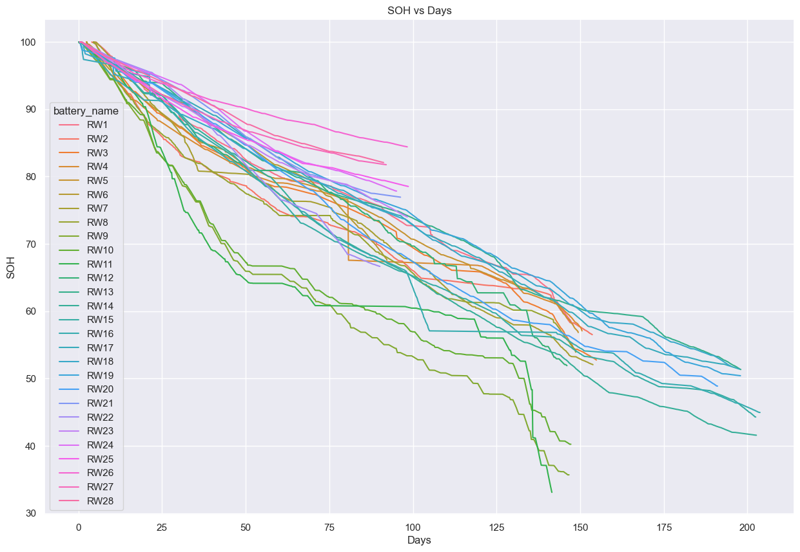

# Lithium-Ion-Battery-Analysis

This github repo contains the code for the analysis of the lithium-ion battery data. The primary used data is :

- [NASA's Randomized Battery Usage](https://www.nasa.gov/content/prognostics-center-of-excellence-data-set-repository) 

## Environment

The code uses `Anaconda 3` and `Python 3.10.11`. The dependencies can be found in the `environment.yml` file. To install the dependencies run the following command in the terminal:

```bash
conda env create -f environment.yml
```

## Code

### nasa_to_csv.py
The most relevant part of the code is `nasa_to_csv.py` which converts the NASA data from `.mat` to `.csv` format. This code does primarily these things:

- Filter out desired cycles (e.g. one can choose to only include charge cycles).
- Compute the SOH for each for the reference discharge cycle.
- Interpolate the SOH for each cycle (the interpolation disregard anomaly cycles which is found manually in `anomaly_cycles.json`)
- Extract features from each cycle (e.g. the mean, variance, etc. of the voltage, current, etc.).
- Save the data to `.csv` format.

The code also extracts features from each cycle. The code can be run using the following command:

```bash
python3 nasa_to_csv.py -p battery datasets/1.Battery_Uniform_Distribution_Charge_Discharge_DataSet_2Post/data/Matlab/RW9.mat battery datasets/1.Battery_Uniform_Distribution_Charge_Discharge_DataSet_2Post/data/Matlab/RW10.mat --save_path processed_datasets -q C --make_monotonic --interpolation_method linear
```

or alternatively, run debug on vscode after adding this to your `launch.json` file in `vscode`:
    
```json
{
    // Use IntelliSense to learn about possible attributes.
    // Hover to view descriptions of existing attributes.
    // For more information, visit: https://go.microsoft.com/fwlink/?linkid=830387
    "version": "0.2.0",
    "configurations": [

        {
            "name": "Python: Module",
            "type": "python",
            "request": "launch",
            "program": "${file}",
            "console": "integratedTerminal",
            "args": [
                "-p", 
                    "battery datasets/1_Battery_Uniform_Distribution_Charge_Discharge_DataSet_2Post/data/Matlab/RW9.mat",
                    "battery datasets/1_Battery_Uniform_Distribution_Charge_Discharge_DataSet_2Post/data/Matlab/RW10.mat",
                    "battery datasets/1_Battery_Uniform_Distribution_Charge_Discharge_DataSet_2Post/data/Matlab/RW11.mat",
                    "battery datasets/1_Battery_Uniform_Distribution_Charge_Discharge_DataSet_2Post/data/Matlab/RW12.mat",
                    "battery datasets/2_Battery_Uniform_Distribution_Discharge_Room_Temp_DataSet_2Post/data/Matlab/RW3.mat",
                    "battery datasets/2_Battery_Uniform_Distribution_Discharge_Room_Temp_DataSet_2Post/data/Matlab/RW4.mat",
                    "battery datasets/2_Battery_Uniform_Distribution_Discharge_Room_Temp_DataSet_2Post/data/Matlab/RW5.mat",
                    "battery datasets/2_Battery_Uniform_Distribution_Discharge_Room_Temp_DataSet_2Post/data/Matlab/RW6.mat",
                    "battery datasets/3_Battery_Uniform_Distribution_Variable_Charge_Room_Temp_DataSet_2Post/data/Matlab/RW1.mat",
                    "battery datasets/3_Battery_Uniform_Distribution_Variable_Charge_Room_Temp_DataSet_2Post/data/Matlab/RW2.mat",
                    "battery datasets/3_Battery_Uniform_Distribution_Variable_Charge_Room_Temp_DataSet_2Post/data/Matlab/RW7.mat",
                    "battery datasets/3_Battery_Uniform_Distribution_Variable_Charge_Room_Temp_DataSet_2Post/data/Matlab/RW8.mat",
                    "battery datasets/4_RW_Skewed_High_40C_DataSet_2Post/data/Matlab/RW25.mat",
                    "battery datasets/4_RW_Skewed_High_40C_DataSet_2Post/data/Matlab/RW26.mat",
                    "battery datasets/4_RW_Skewed_High_40C_DataSet_2Post/data/Matlab/RW27.mat",
                    "battery datasets/4_RW_Skewed_High_40C_DataSet_2Post/data/Matlab/RW28.mat",
                    "battery datasets/5_RW_Skewed_High_Room_Temp_DataSet_2Post/data/Matlab/RW17.mat",
                    "battery datasets/5_RW_Skewed_High_Room_Temp_DataSet_2Post/data/Matlab/RW18.mat",
                    "battery datasets/5_RW_Skewed_High_Room_Temp_DataSet_2Post/data/Matlab/RW19.mat",
                    "battery datasets/5_RW_Skewed_High_Room_Temp_DataSet_2Post/data/Matlab/RW20.mat",
                    "battery datasets/6_RW_Skewed_Low_40C_DataSet_2Post/data/Matlab/RW21.mat",
                    "battery datasets/6_RW_Skewed_Low_40C_DataSet_2Post/data/Matlab/RW22.mat",
                    "battery datasets/6_RW_Skewed_Low_40C_DataSet_2Post/data/Matlab/RW23.mat",
                    "battery datasets/6_RW_Skewed_Low_40C_DataSet_2Post/data/Matlab/RW24.mat",
                    "battery datasets/7_RW_Skewed_Low_Room_Temp_DataSet_2Post/data/Matlab/RW13.mat",
                    "battery datasets/7_RW_Skewed_Low_Room_Temp_DataSet_2Post/data/Matlab/RW14.mat",
                    "battery datasets/7_RW_Skewed_Low_Room_Temp_DataSet_2Post/data/Matlab/RW15.mat",
                    "battery datasets/7_RW_Skewed_Low_Room_Temp_DataSet_2Post/data/Matlab/RW16.mat",
                    "--save_path", "processed_datasets",
                "-q", "C",
                "--make_monotonic",
                "--interpolation_method", "linear",
            ],
            "justMyCode": true,

        }
    ]
}
```

### charge_soh_analysis.ipynb

Includes the analysis of the charge SOH. Here is an image of the charge SOH for each battery:


The numbers of cycles for each battery is shown in the table below. The mean and variance of the time range for each battery is also shown. The time range is the time between the first and last cycle for each battery. The time span is the time between the first and last cycle for all batteries. The days per cycle is the time span divided by the number of cycles, which is useful to get an idea of the how far into the future we are able to predict.

| battery_name   |   total cycle |   mean timeRange (hours) |   var timeRange (hours) |   time span (days) |   days per cycle |
|:---------------|--------------:|-------------------------:|------------------------:|-------------------:|-----------------:|
| RW1            |          1214 |                1.57229   |               4.14783   |                143 |       0.117792   |
| RW10           |         20282 |                0.072732  |               0.099415  |                147 |       0.00724781 |
| RW11           |         19365 |                0.0732439 |               0.0956984 |                141 |       0.00728118 |
| RW12           |         18542 |                0.0773774 |               0.0881283 |                146 |       0.00787402 |
| RW13           |          1015 |                2.71734   |               0.470453  |                198 |       0.195074   |
| RW14           |          1134 |                2.65489   |               0.794885  |                203 |       0.179012   |
| RW15           |          1141 |                2.62395   |               0.686857  |                202 |       0.177038   |
| RW16           |           915 |                2.65494   |               0.978887  |                204 |       0.222951   |
| RW17           |          1246 |                2.02593   |               0.684193  |                198 |       0.158909   |
| RW18           |          1164 |                2.20296   |               0.709035  |                195 |       0.167526   |
| RW19           |          1126 |                2.16681   |               0.665713  |                198 |       0.175844   |
| RW2            |          1315 |                1.49935   |               2.56011   |                150 |       0.114068   |
| RW20           |          1306 |                2.02091   |               0.807284  |                191 |       0.146248   |
| RW21           |           520 |                2.52681   |               0.062232  |                 96 |       0.184615   |
| RW22           |           469 |                2.69856   |               0.270512  |                 90 |       0.191898   |
| RW23           |           515 |                2.63735   |               0.0918062 |                 98 |       0.190291   |
| RW24           |           517 |                2.52135   |               0.0816118 |                 95 |       0.183752   |
| RW25           |           625 |                2.27971   |               0.0921393 |                 99 |       0.1584     |
| RW26           |           660 |                2.06342   |               0.1526    |                 98 |       0.148485   |
| RW27           |           573 |                2.29213   |               0.0530078 |                 92 |       0.160558   |
| RW28           |           573 |                2.29418   |               0.0576478 |                 90 |       0.157068   |
| RW3            |           843 |                2.86316   |               0.276065  |                153 |       0.181495   |
| RW4            |           728 |                3.4415    |               0.569025  |                149 |       0.20467    |
| RW5            |           737 |                3.28825   |               0.381012  |                148 |       0.200814   |
| RW6            |           403 |                3.39823   |               0.169221  |                 90 |       0.223325   |
| RW7            |          1268 |                1.49843   |               2.40238   |                149 |       0.117508   |
| RW8            |          1240 |                1.53637   |               3.88119   |                143 |       0.115323   |
| RW9            |         20506 |                0.0723593 |               0.106216  |                146 |       0.00711987 |
